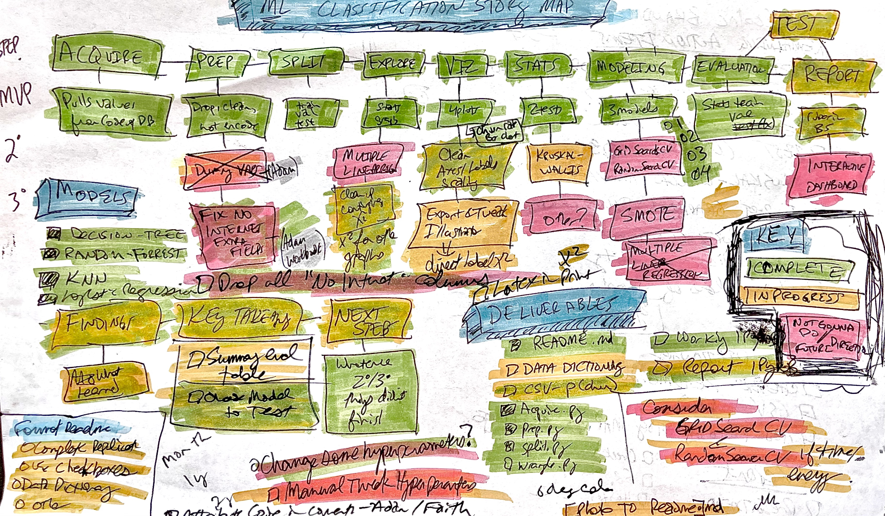

# classification-project
The repsitory contains the files for Jared Godar's first Codeup project on classification and modeling of telco churn.

## About the Project

### Project Goals

The main goal of this project is to be able to accurately predict the likelyhood that an existing customer whill terminate their services with Telco, Inc. 

This will be accomplished by using past customer data to create multiple prediction models, rating the effectiveness of each model, and testing the best model on new data is has never seen.

Having this new information will allow us to identify factors that cause customer turnover, which customers we are most at risk of using, and devise srtategies to retain these customers. 

### Project Description

This project provides the opportunity to create and evaluate multiple predictive models as well as implement other essential parts of the data science pipeline.

It will incolve pulling relavant data from a SQL database; cleaning that data; splitting the data into training, validation, and test sets; feature engineering; exploratory data analysis; modeling; model evaluation; model testing; and effectively communicating findings in written and oral formats.

Finding new customers is expensive in terms of both money and effort: advertising, onboarding promotions, new customer support and education, etc. 

One way to increase revenue and active customers, is to decrease the number of customers leaving. In order to accomplish this, it will be helpful to know which customers are leaving and why.

Once we have this information, we can devise new customer retention strategies.

### Initial Questions

- What are the main drivers of churn?
- What are the relative importances of the assorted drivers?
- Are there any other potentially useful features that can be engineered from the current data available?
- Are the relationships suggested by initial visualizations statistically significant?
- Is the data balanced or unbalanced?
- Are there null values or missing data that must be addressed?
- Are there any duplicates in the dataset?
- What are the specific business consequences for different prediction outcomes (false positive, false negative)?
- Which model feature is most important for this data and business case?
- Which model evaluation metrics are most sensitive to this primary feature?

### Data Dictionary

## Data Dictionary

|Target|Datatype|Definition|
|:-------|:--------|:----------|
| churn_encoded | int64 | 0: Customer retained 1: Customer Churned|

 
 

 

|Feature|Datatype|Definition|
|:-------|:--------|:----------|
| senior_citizen       | int64 |    0: Not Senior 1: Senior |
| monthly_charges        | float64 |    month;y charges in dollars |
| tenure       | 
 int64 |    tenure in months |
| paperless_billing_encoded        | int64 |    i0: no paperless billing 1:paperless billing |
| internet_service_type_Fiber optic        | uint8 |    0: No fiber 1: fiber |
| payment_type_Electronic check        | uint8 |    0: no e-check 1:e-check |

### Steps to Reproduce

You will need your own env file with database credentials along with all the necessary files listed below to run my final project notebook. 
- [x] Read this README.md
- [ ] Download the telco_aquire.py, telco_prepare.py, and telco_project_report.ipynb files into your working directory
- [ ] Add your own env file to your directory. (user, password, host)
- [ ] telco_project_report.ipynb

### The Plan

1. **Acquire, clean, prepare, and split the data:**
    - Pull from telco database.
    - Eliminate any unnecessary or redundant fields.
    - Engineer new, potentially informative features.
    - Search for null values and respond appropriately (delete, impute, etc.).
    - Make dummy variables and one-hot encode any categorical variable.
    - Divide the data in to training, validation, and testing sets.
2. **Exploratory data analysis:**
    - Visualize pairwaise relationships looking for correlation with churn in the main customer population as well as within relavant subgroups (age, gender, sercive type, etc.).
    - Note any interesting correlations or other findings.
    - Test presumptive relationships for statistical significance.
    -  Think of what modeling techniques would be appropriate or most useful given the unique features of data discovered.
    - Record any other interesng observations or findings.
    *NOTE: This data analysis will be limited to the training dataset*
3. **Model generation, assessment, and optimization:**
    - Generate multiple models to predict churn using a varity of classification techniques.
    - Calculate a baseline prediction for comparison.
    - Calculate evaluation metrics to assess quality of models (accuracy, NPV, recall, F1, etc.)
    - Generate multiple models for each technique by changing hyperparameters and evaluate each looking for the model with the highest accuracy on the training and validation sets with the least overfitting, observed as the difference between the training and validation predictions.
    - Determine which metric is most important for assessment based on specific business case.
    - Use that metric to select the highest performing model.
    - Test that model with the previously unused and unseen test data once and only once.
4. **Streamline presentation**
    - Take only the most relative information from the working along and create a succinct report that walks through the rationale, steps, code, and observations for the entire data science pipeline of acquiring, cleaning, preparing, modeling, evaluating, and testing our model.
    - Using this new-found information, devise strategies to retain customers.
    - Outline next steps for this project:
        - Potential specific changes designed to retain customers
        - Strategy to tests and evaluate implementation of those changes
        - Potential revenu and savings for success

#### Wrangle

##### Modules (acquire.py + prepare.py + split.py + wrangle.py)

##### Missing Values (report.ipynb)

- Communicate decisions and reasoning for handling of missing values.

##### Data Split (prepare.py (def function), report.ipynb (run function))

~50%-30%-20% split train-validate-test; Varies depending on observations, test can be as low as 10%

- Set random state of seed so split will be reproducable

- Always split before exploring variable relationships

##### Using modules

- After creating, want to import those into final report so you can use the functions ti acquire and prepare your data without clutter.

- Call functions and include a markdown cell describing steps.

#### Explore

##### Ask a clear question, [discover], provide a clear answer (report.ipynb)

- Share four questions in final report
    - >=2 supported by statistical test

- *You should call out questions of the data using natural language that speaks to the business stakeholders in markdown cells, ideally a header prior to the visualization or statistical test, that you then explore. This does not take the place of stating your null hypothesis/alternative hypothesis when doing a statistical test. But those hypotheses are generally for you. By writing questions that you intend to answer with visualizations and statistical tests in natural language, like ""Are office supplies leading to differences in profit in Texas?"", you are able to guide both yourself and your reader through the highlights of your analysis. You ask a question, create a visual, run a statistical test (if appropriate), and wrap it nicely with a markdown cell that contains a clear answer in layman's terms. You do all that before moving to the next question.*

##### Exploring through visualizations (report.ipynb)

- *At least 5 visualations are included in your final report.*

- *The ones included answer a question (remember, NO is an answer) or provide necessary context (such as the distribution of the target variable). All statistical tests included in the final report should be supported with an visualization of the interaction of the variables being tested. Charts in the final report should have titles and labels that are descriptive and useful for the end user/audience/consumer of the report.*

- *All visualizations in the final report are mentioned or discussed if a verbal presentation is given.*

##### Statistical tests (report.ipynb)

- *At least 2 statistical tests are included in your final report.*

- *The correct tests are run, given the data type and distribution, and the correct conclusions are drawn. For example (other tests may be used):*

  - *correlation: 2 continuous variables, normally distributed, testing for LINEAR correlation only (H_0: Not linearly dependent)*

  - *independent t-test: 1 continuous, somewhat normally distributed variable, one boolean variable, equal variance, independent (H_0: population mean of each group is equal)*
  
  - *chi-square test: 2 discrete variables. (H_0: the 2 variables are independent of each other).*

##### Summary (report.ipynb)

- *Following your exploration section, you summarize your analysis (in a **markdown** cell using natural language): what you found and how you will use it moving forward.*

##### Select Evaluation Metric (Report.ipynb)

- *Will use accuracy and recall.*

##### Evaluate Baseline (Report.ipynb)

- *Baseline predicts everyone will remain. 73% accurate*

##### Develop 3 Models (Report.ipynb)

- *Made 4 models: decision tree, random forrest, knn, and logistic regression*

#### Evaluate on Train (Report.ipynb)

##### Evaluate on Validate (Report.ipynb)

#### Evaluate Top Model on Test (Report.ipynb)

 seen.*

## Report (Final Notebook) 
